<div align="center">

# Casino Mathematics Education Platform

### A Transparent Probability Simulation System for Understanding Casino Game Mathematics

[](https://www.gnu.org/licenses/gpl-3.0)
[](https://www.typescriptlang.org/)
[](https://react.dev/)
[](https://vitejs.dev/)
[](https://github.com/yourusername/casino-education-platform)
[](LICENSE.md)
[](#provably-fair-system)

**13 Fully-Functional Casino Games** • **Zero Real Money** • **Complete Mathematical Transparency**

[Overview](#overview) • [Architecture](#system-architecture) • [Installation](#installation) • [Documentation](#mathematical-foundations) • [License](#license)

</div>

-----

## 📋 Table of Contents

<details>
<summary>Click to expand full table of contents</summary>

- [Overview](#overview)
- [Educational Mission](#educational-mission)
- [Mathematical Foundations](#mathematical-foundations)
  - [Expected Value](#expected-value)
  - [House Edge](#house-edge)
  - [Return to Player (RTP)](#return-to-player-rtp)
- [System Architecture](#system-architecture)
- [Probability Engine](#probability-engine)
- [Game Implementations](#game-implementations)
- [Technology Stack](#technology-stack)
- [Installation](#installation)
- [Project Structure](#project-structure)
- [Extending the Platform](#extending-the-platform)
- [Statistics & Analytics](#statistics--analytics)
- [Provably Fair System](#provably-fair-system)
- [Educational Applications](#educational-applications)
- [Transparency Statement](#transparency-statement)
- [License](#license)
- [Contributing](#contributing)
- [Contact](#contact)

</details>

-----

## Overview

This is an educational casino simulation platform implementing **13 fully-functional games** with complete transparency into probability mechanics, house edge implementation, and outcome generation.

### Core Educational Objective

> **When house edge > 0, long-term player loss is mathematically guaranteed.**

This occurs not through deception or cheating, but through the fundamental structure of probability-based systems.

### Key Characteristics

|Feature                      |Description                                                          |
|-----------------------------|---------------------------------------------------------------------|
|**Pure Probability Engine**  |Deterministic outcome generation from cryptographic seed pairs       |
|**Mathematical Transparency**|Every house edge percentage is explicit and verifiable in source code|
|**Zero Real Money**          |Virtual currency system for risk-free exploration                    |
|**Open Source**              |GPL-3.0 licensed for study, modification, and educational use        |
|**Production-Grade**         |Enterprise-level TypeScript implementation with React 18             |

### Platform Statistics

```
Games Implemented:     13
House Edge Range:      0.5% - 5.0%
Lines of Code:         ~8,000
Type Safety:           100% TypeScript
Test Coverage:         Educational simulation (no real money)
License:               GPL-3.0
```

-----

## Educational Mission

### The Mathematical Reality of Negative Expected Value

Every game in this platform demonstrates a fundamental mathematical principle:

```
Expected Value (EV) = Σ(Probability_i × Payout_i) - Stake

For all casino games: EV < 0
```

When expected value is negative, the **law of large numbers** guarantees that over time, player losses converge to the house edge percentage.

**This is not probability. This is mathematical certainty.**

<details>
<summary><strong>📊 Click to view detailed Expected Value example</strong></summary>

### Example: Understanding Expected Value

Consider a simple dice game with 50% win chance:

```
Configuration:
- Win Probability: 50%
- Bet Amount: 100
- House Edge: 1%

Calculation:
Fair payout would be:    100 / 0.50 = 2.00x
Actual payout:           (1 - 0.01) / 0.50 = 1.98x

Expected Value per bet:
EV = (0.50 × 198) - 100 = 99 - 100 = -1

Over 1,000 bets:
Expected Loss = 1,000 × 1 = 1,000 (1% of total wagered)
```

**Conclusion:** The house edge is not a “fee” that can be avoided through skill or strategy. It is embedded in the payout structure of every game, making long-term profit mathematically impossible.

</details>

### Why This Platform Exists

|Objective                        |Description                                                             |
|---------------------------------|------------------------------------------------------------------------|
|**Counter Misinformation**       |Many gambling platforms obscure their mathematics. We expose everything.|
|**Demonstrate Provable Fairness**|Show how cryptographic determinism works in practice.                   |
|**Teach Probability**            |Provide a sandbox for understanding stochastic systems.                 |
|**Prevent Financial Harm**       |Allow users to experience casino mechanics without risking real money.  |

-----

## Mathematical Foundations

### Expected Value

Expected value represents the average outcome of a bet if repeated infinitely.

**Formula:**

```
EV = Σ(P(outcome_i) × value(outcome_i))
```

**Interpretation:**

```
EV = 0   →  Fair bet
EV > 0   →  Profitable bet
EV < 0   →  Losing bet (casino games)
```

<details>
<summary><strong>🎯 Click to view Roulette Expected Value calculation</strong></summary>

### Example: Roulette Single Number Bet

European Roulette has 37 pockets numbered 0-36.

```
Configuration:
P(win) = 1/37
P(loss) = 36/37
Payout = 35:1 (bet 1, win 35)

Calculation:
EV = (1/37 × 35) - (36/37 × 1)
   = 0.946 - 0.973
   = -0.027
   = -2.7%

Result: For every 100 wagered, expected loss is 2.70
```

</details>

### House Edge

House edge is the mathematical advantage the casino has over players, expressed as a percentage.

**Formula:**

```
House Edge = |Expected Value| / Stake
```

**Alternative formulation:**

```
House Edge = 1 - (Actual Payout / Fair Payout)
```

<details>
<summary><strong>🚀 Click to view Crash Game house edge implementation</strong></summary>

### Example: Crash Game

The Crash game implements house edge through instant-loss probability:

```typescript
public getCrashPoint(r: number): number {
  const houseEdge = 0.03; 
  if (r < houseEdge) return 1.00;  // 3% instant crash
  return (1 - houseEdge) / (1 - r);
}
```

**Analysis:**

- 3% of rounds crash instantly at 1.00x (total loss)
- Remaining 97% follow formula: `(0.97) / (1 - r)`
- This reduces all multipliers by 3%, creating house edge

**Distribution:**

```
P(crash at 1.00x) = 3%
P(crash at 1.5x) ≈ 35% 
P(crash at 2.0x) ≈ 48%
P(crash at 10.0x) ≈ 10%
P(crash at 100x) ≈ 1%
```

</details>

### Return to Player (RTP)

RTP is the inverse of house edge, representing the theoretical percentage of wagered money returned to players over infinite iterations.

```
RTP = 1 - House Edge
```

#### Platform RTP Values

|Game     |RTP   |House Edge|Implementation Method        |
|---------|------|----------|-----------------------------|
|Blackjack|99.5% |0.5%      |Optimal strategy deviation   |
|Dice     |99.0% |1.0%      |Payout reduction             |
|Baccarat |98.94%|1.06%     |Commission structure         |
|Crash    |97.0% |3.0%      |Instant loss probability     |
|Slots    |96.0% |4.0%      |Weighted symbol probabilities|
|Matka    |95.0% |5.0%      |Asymmetric payouts           |

<details>
<summary><strong>⚠️ Critical Understanding: RTP vs Bankroll</strong></summary>

RTP represents percentage of **total wagered** returned, not percentage of **bankroll** retained.

### Example Scenario

```
Starting Bankroll:  10,000
Bet Amount:         100
RTP:                96%
Bets Placed:        100

Calculation:
Total Wagered:      10,000
Expected Return:    9,600
Expected Loss:      400

Important Note:
Actual bankroll loss is unpredictable due to variance.
Some users will lose everything.
Others may be temporarily ahead.
Over infinite time, all converge to -4% of total wagered.
```

</details>

-----

## System Architecture

### High-Level Architecture Diagram

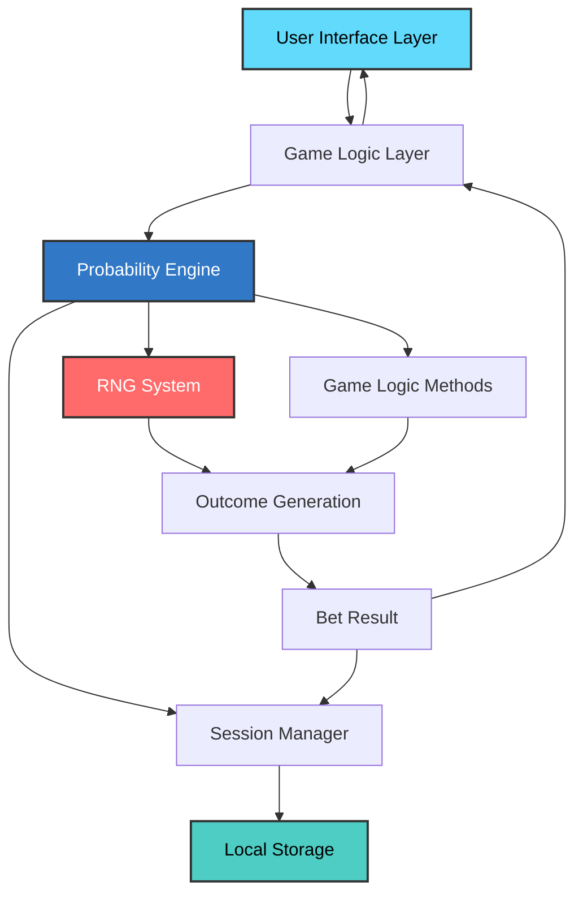

### Execution Flow Diagram

```mermaid
sequenceDiagram
    participant U as User
    participant UI as UI Component
    participant G as Game Logic
    participant E as Engine
    participant RNG as RNG System
    participant S as Session Manager
    
    U->>UI: Place Bet (amount, params)
    UI->>G: handleBet()
    G->>E: placeBet(gameType, amount, resolver)
    E->>S: Deduct balance
    E->>RNG: peekNextRandom()
    RNG-->>E: r (0.0 to 1.0)
    E->>E: resolver(r) → {multiplier, outcome}
    E->>E: Calculate payout
    E->>S: Update balance + stats
    S->>S: Save to localStorage
    E-->>G: BetResult
    G-->>UI: Update state
    UI-->>U: Display outcome
```

### Layer Separation

The architecture follows strict separation of concerns:

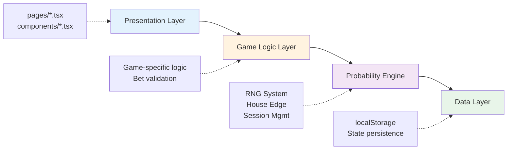

<details>
<summary><strong>🏗️ Click to view detailed layer responsibilities</strong></summary>

### Presentation Layer

**Location:** `pages/*.tsx`, `components/*.tsx`

**Responsibilities:**

- User interface rendering
- User input handling
- Visual feedback (animations, charts)
- No game logic

### Game Logic Layer

**Location:** `pages/*.tsx` (game-specific logic)

**Responsibilities:**

- Game-specific rules
- Bet validation
- Outcome interpretation
- Delegates probability to engine

### Probability Engine

**Location:** `services/engine.ts`

**Responsibilities:**

- Core RNG system
- Outcome generation
- House edge implementation
- Session management
- State persistence

### Data Layer

**Location:** Browser `localStorage`

**Responsibilities:**

- Session persistence
- History tracking
- Statistics aggregation

**Key Insight:** This separation ensures that probability logic is centralized and auditable. All games use the same underlying RNG system, preventing inconsistencies.

</details>

-----

## Probability Engine

### Core Engine Architecture

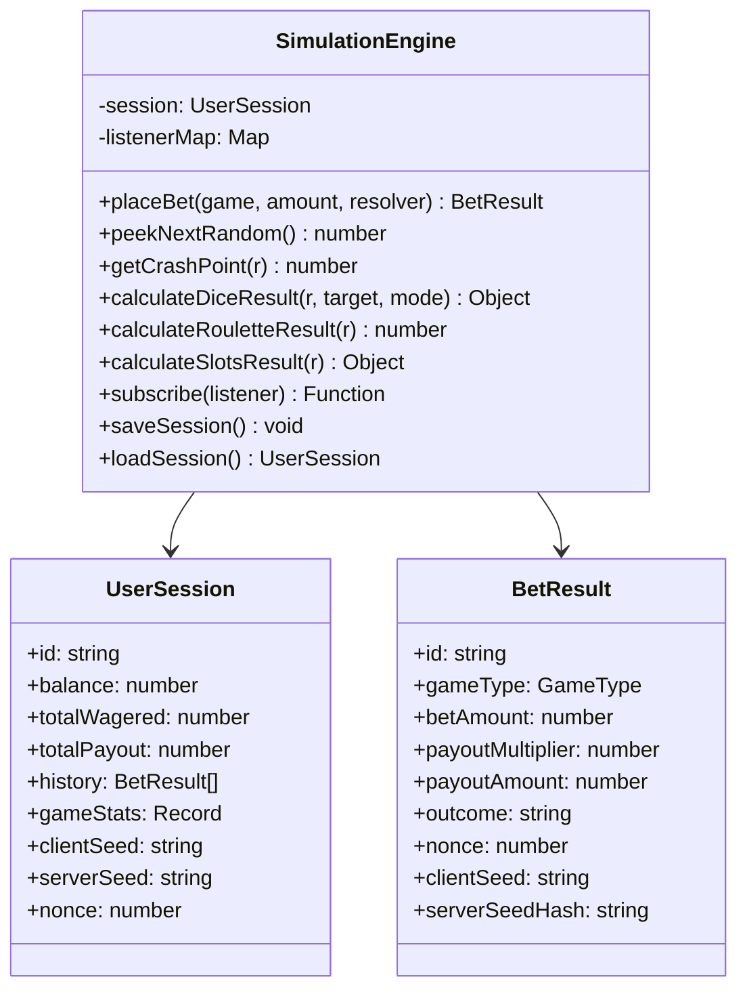

### Outcome Generation Flow

Every bet follows this deterministic sequence:

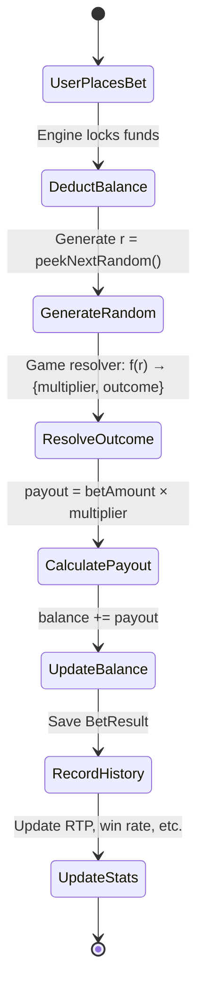

**Critical Property:** The random number `r` is generated **before** the outcome is calculated. This creates provable fairness—the result is predetermined before the user makes any decision.

<details>
<summary><strong>🎲 Click to view Dice Game implementation example</strong></summary>

### Example: Dice Game Implementation

**Game-specific code** (in `Dice.tsx`):

```typescript
engine.placeBet(GameType.DICE, betAmount, (r) => {
  const { roll, won } = engine.calculateDiceResult(r, target, mode);
  return { 
    multiplier: won ? multiplier : 0, 
    outcome: `Rolled ${roll.toFixed(2)}` 
  };
});
```

**Probability engine code** (in `engine.ts`):

```typescript
public calculateDiceResult(
  r: number, 
  target: number, 
  mode: 'over' | 'under'
) {
  const roll = r * 100;  // Convert [0,1) to [0,100)
  const won = mode === 'over' ? roll > target : roll < target;
  return { roll, won };
}
```

**Multiplier calculation** (in `Dice.tsx`):

```typescript
const houseEdge = HOUSE_EDGES.DICE;  // 0.01 (1%)
const multiplier = (100 - (houseEdge * 100)) / winChance;

// Example: 50% win chance
// Fair multiplier: 100 / 50 = 2.00x
// Actual: (100 - 1) / 50 = 1.98x
// Difference: 0.02x = 1% house edge
```

</details>

### House Edge Implementation Methods

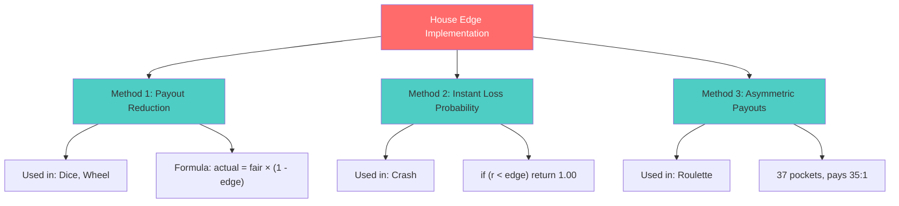

-----

## Game Implementations

### Crash (Aviator)

**Mathematical Model:** Exponential growth with probabilistic crash

<details>
<summary><strong>🚀 Click to view Crash game details</strong></summary>

**Multiplier growth function:**

```typescript
// In Crash.tsx
const currentMultiplier = Math.pow(Math.E, 0.06 * elapsedSeconds);
```

**Crash point determination:**

```typescript
// In engine.ts
public getCrashPoint(r: number): number {
  const houseEdge = 0.03;
  if (r < houseEdge) return 1.00;  // 3% instant crash
  return (1 - houseEdge) / (1 - r);
}
```

**House Edge:** 3%

**Distribution characteristics:**

|Crash Point|Probability|
|-----------|-----------|
|1.00x      |3%         |
|1.5x       |~35%       |
|2.0x       |~48%       |
|10.0x      |~10%       |
|100x       |~1%        |

The exponential formula creates high variance. Most games crash early, but rare high multipliers create the illusion of opportunity.

</details>

### Dice

**Mathematical Model:** Uniform distribution with dynamic payout

<details>
<summary><strong>🎲 Click to view Dice game details</strong></summary>

**Roll generation:**

```typescript
const roll = randomValue * 100;  // [0, 100)
```

**Win condition:**

```typescript
const won = (mode === 'over') ? roll > target : roll < target;
```

**Payout calculation:**

```typescript
const winProbability = (mode === 'over') 
  ? (100 - target) / 100 
  : target / 100;

const fairMultiplier = 1 / winProbability;
const actualMultiplier = fairMultiplier * (1 - houseEdge);
```

**House Edge:** 1%

**Example:**

```
Mode: Roll Over 50
Win Probability: 50%
Fair Multiplier: 2.00x
Actual Multiplier: 1.98x
House Edge: 1%
```

</details>

### Roulette

**Mathematical Model:** Single-zero European roulette

<details>
<summary><strong>🎡 Click to view Roulette game details</strong></summary>

**Pocket generation:**

```typescript
const pocket = Math.floor(randomValue * 37);  // 0-36
```

**Payouts:**

|Bet Type     |Win Probability|Payout|House Edge|
|-------------|---------------|------|----------|
|Single Number|1/37 (2.7%)    |35:1  |2.7%      |
|Red/Black    |18/37 (48.6%)  |1:1   |2.7%      |
|Dozen        |12/37 (32.4%)  |2:1   |2.7%      |
|Even/Odd     |18/37 (48.6%)  |1:1   |2.7%      |

**House Edge:** 2.7%

**Key Insight:** The zero pocket creates house edge. All bets lose when zero hits, but payouts are calculated as if there are only 36 pockets.

</details>

### Slots

**Mathematical Model:** Weighted symbol probabilities

<details>
<summary><strong>🎰 Click to view Slots game details</strong></summary>

**Symbol generation:**

```typescript
public calculateSlotsResult(r: number) {
  const symbols = ['🍒', '🍋', '🍇', '💎', '7️⃣'];
  
  // Each reel uses different RNG transformation
  const s1 = symbols[Math.floor(r * 5)];
  const s2 = symbols[Math.floor((r * 2.5 * 10) % 5)];
  const s3 = symbols[Math.floor((r * 3.3 * 10) % 5)];
  
  // Payout logic
  if (s1 === s2 && s2 === s3) {
    if (s1 === '7️⃣') return { multiplier: 100 };
    if (s1 === '💎') return { multiplier: 50 };
    return { multiplier: 20 };
  }
}
```

**House Edge:** 4%

**RTP breakdown:**

|Outcome      |Probability|Payout|Contribution|
|-------------|-----------|------|------------|
|7️⃣ 7️⃣ 7️⃣        |~0.8%      |100x  |0.8%        |
|💎 💎 💎        |~0.8%      |50x   |0.4%        |
|Other triple |~2.4%      |20x   |0.48%       |
|Any pair     |~15%       |2x    |0.30%       |
|**Total RTP**|           |      |**~96%**    |

**Critical Insight:** The “near-miss” effect (e.g., 🍇🍇🍋) is not actually a near-miss. It’s a complete loss with the same probability as any other losing combination. The psychological impact is what makes slots effective.

</details>

-----

## Technology Stack

### Core Technologies

|Component     |Technology  |Version|Purpose                              |
|--------------|------------|-------|-------------------------------------|
|**Framework** |React       |18.2.0 |UI rendering and state management    |
|**Language**  |TypeScript  |5.2.2  |Type safety and developer experience |
|**Build Tool**|Vite        |5.1.0  |Fast development and optimized builds|
|**Routing**   |React Router|6.22.0 |Client-side navigation               |
|**Charts**    |Recharts    |2.12.0 |Statistical visualization            |

### Technology Stack Visualization

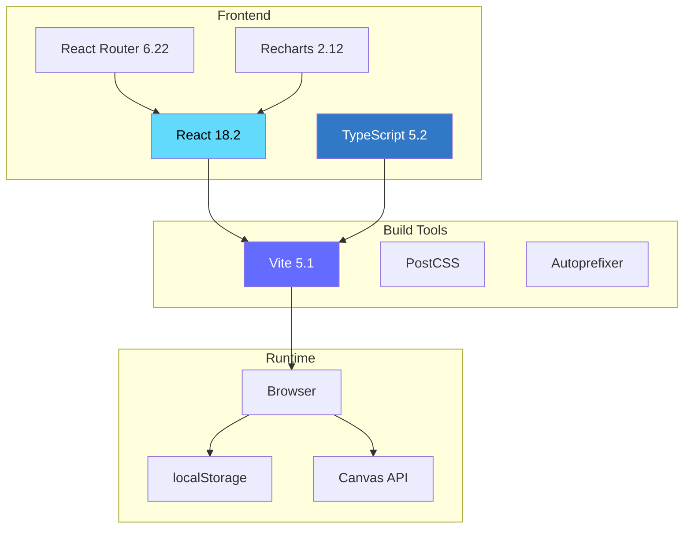

### Performance Optimizations

|Optimization          |Implementation                      |Impact                    |
|----------------------|------------------------------------|--------------------------|
|**Canvas Rendering**  |HTML5 Canvas for 60fps animations   |Smooth visual feedback    |
|**Throttled Updates** |Batch high-frequency updates        |Reduced re-render overhead|
|**Memoization**       |`useMemo` for expensive calculations|Faster computation        |
|**Storage Debouncing**|Throttled localStorage writes       |Reduced I/O operations    |
|**Code Splitting**    |React Router lazy loading           |Faster initial load       |

-----

## Installation

### Prerequisites

```bash
Node.js:  v18.0.0 or higher
npm:      v9.0.0 or higher
Browser:  Chrome 90+, Firefox 88+, Safari 14+, Edge 90+
```

### Quick Start

```bash
# Clone repository
git clone https://github.com/yourusername/casino-education-platform.git
cd casino-education-platform

# Install dependencies
npm install

# Start development server
npm run dev
```

### Build Commands

|Command          |Description                                     |
|-----------------|------------------------------------------------|
|`npm run dev`    |Start development server (http://localhost:5173)|
|`npm run build`  |Build for production (output: `dist/`)          |
|`npm run preview`|Preview production build locally                |

### Build Optimizations

The production build includes:

- ✅ TypeScript compilation
- ✅ Tree shaking (dead code elimination)
- ✅ Minification
- ✅ Asset optimization
- ✅ Code splitting

### Deployment Options

```bash
# Vercel
vercel --prod

# Netlify
netlify deploy --prod

# GitHub Pages
npm run build && gh-pages -d dist

# Any static file host
# Copy dist/ contents to web root
```

-----

## Project Structure

```
casino-main/
├── 📁 services/
│   ├── engine.ts                  # Core probability engine
│   └── audio.ts                   # Sound effect management
│
├── 📁 pages/
│   ├── Crash.tsx                  # Aviator crash game
│   ├── Dice.tsx                   # Dice roll game
│   ├── Roulette.tsx               # European roulette
│   ├── Slots.tsx                  # 3-reel slot machine
│   ├── Blackjack.tsx              # Blackjack card game
│   ├── Baccarat.tsx               # Baccarat card game
│   ├── Mines.tsx                  # Minesweeper-style game
│   ├── Plinko.tsx                 # Probability board game
│   ├── Wheel.tsx                  # Wheel of fortune
│   ├── Coinflip.tsx               # Coin flip game
│   ├── Keno.tsx                   # Number selection game
│   ├── Matka.tsx                  # Indian lottery game
│   ├── TeenPatti.tsx              # Indian card game
│   ├── Lobby.tsx                  # Game selection interface
│   ├── Statistics.tsx             # Analytics dashboard
│   ├── Fairness.tsx               # Provably fair explanation
│   ├── Admin.tsx                  # Admin controls
│   └── Transactions.tsx           # Bet history viewer
│
├── 📁 components/
│   ├── Layout.tsx                 # Main layout wrapper
│   ├── Analytics.tsx              # Real-time statistics
│   ├── TransparencyPanel.tsx      # House edge disclosure
│   ├── Leaderboard.tsx            # User rankings
│   ├── LiveFeed.tsx               # Recent bets feed
│   └── MarketingOverlay.tsx       # Educational overlays
│
├── 📄 types.ts                    # TypeScript type definitions
├── 📄 App.tsx                     # Root component
├── 📄 index.tsx                   # Application entry point
├── 📄 index.html                  # HTML template
├── 📄 vite.config.ts              # Build configuration
└── 📄 package.json                # Dependencies manifest
```

<details>
<summary><strong>📂 Click to view detailed file descriptions</strong></summary>

### Key Files

#### `services/engine.ts`

The mathematical core containing:

- `SimulationEngine` class
- RNG system (`peekNextRandom()`)
- Game logic methods (`getCrashPoint()`, `calculateDiceResult()`, etc.)
- Session management
- State persistence

#### `types.ts`

Type definitions including:

- `UserSession` - Player state structure
- `BetResult` - Bet outcome data structure
- `GameType` - Enum of all game types
- `HOUSE_EDGES` - House edge constant mapping

#### `pages/*.tsx`

Game implementations following a consistent pattern:

1. Accept user input (bet amount, game parameters)
1. Call `engine.placeBet()` with resolver function
1. Display outcome with animations
1. Update local UI state

</details>

-----

## Extending the Platform

### Adding a New Game

Follow this four-step process to add a new game to the platform.

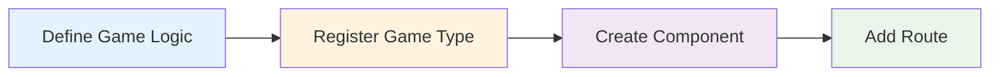

<details>
<summary><strong>➕ Click to view detailed implementation steps</strong></summary>

#### Step 1: Define Game Logic

Add game-specific logic to `services/engine.ts`:

```typescript
public calculateNewGameResult(r: number, params: any) {
  // Use r (uniform random [0,1)) to determine outcome
  // Implement house edge in payout calculation
  return { won: boolean, multiplier: number };
}
```

#### Step 2: Register Game Type

Update `types.ts`:

```typescript
export enum GameType {
  // ... existing games
  NEWGAME = 'NEWGAME',
}

export const HOUSE_EDGES: Record<GameType, number> = {
  // ... existing edges
  [GameType.NEWGAME]: 0.02,  // 2% house edge
};
```

#### Step 3: Create Game Component

Create `pages/NewGame.tsx`:

```typescript
export default function NewGame() {
  const [betAmount, setBetAmount] = useState(100);
  
  const handleBet = () => {
    engine.placeBet(GameType.NEWGAME, betAmount, (r) => {
      const { won, multiplier } = engine.calculateNewGameResult(r, params);
      return { multiplier, outcome: won ? 'Win' : 'Loss' };
    });
  };
  
  return <Layout>{/* Game UI */}</Layout>;
}
```

#### Step 4: Add Route

Update `App.tsx`:

```typescript
<Route path="/newgame" element={<NewGame />} />
```

</details>

### Modifying House Edge

House edges are defined as constants in `types.ts`:

```typescript
export const HOUSE_EDGES: Record<GameType, number> = {
  [GameType.CRASH]: 0.01,   // 1% - Change to 0.02 for 2%
  [GameType.DICE]: 0.01,    // 1%
  [GameType.ROULETTE]: 0.027, // 2.7%
  // ...
};
```

⚠️ **Warning:** Changing house edge affects game balance:

- Lower edge = higher variance, slower convergence
- Higher edge = faster player loss, lower variance

-----

## Statistics & Analytics

### Tracked Metrics

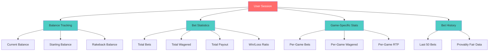

<details>
<summary><strong>📊 Click to view statistics implementation details</strong></summary>

### User Session Structure

```typescript
interface UserSession {
  // Session identification
  id: string;
  username: string;
  
  // Balance tracking
  balance: number;
  startBalance: number;
  rakebackBalance: number;
  
  // Aggregate statistics
  totalBets: number;
  totalWagered: number;
  totalPayout: number;
  totalWins: number;
  totalLosses: number;
  maxMultiplier: number;
  
  // Per-game statistics
  gameStats: Record<GameType, {
    bets: number;
    wagered: number;
    payout: number;
    wins: number;
  }>;
  
  // Bet history (last 50)
  history: BetResult[];
  
  // Provably fair data
  clientSeed: string;
  serverSeed: string;
  nonce: number;
}
```

### Real-Time RTP Calculation

```typescript
const actualRTP = (totalPayout / totalWagered) * 100;

// Example output:
// Total Wagered: 100,000
// Total Payout: 96,500
// Actual RTP: 96.5%
// Expected RTP: 97.0% (weighted average)
// Variance: -0.5% (normal statistical variation)
```

### Bet History Structure

```typescript
interface BetResult {
  id: string;
  gameType: GameType;
  betAmount: number;
  payoutMultiplier: number;
  payoutAmount: number;
  timestamp: number;
  outcome: string;
  balanceAfter: number;
  
  // Provably fair verification data
  nonce: number;
  clientSeed: string;
  serverSeedHash: string;
  resultInput: number;  // The random value used
}
```

This structure allows full post-bet verification of fairness.

</details>

-----

## Provably Fair System

### Cryptographic Determinism

```mermaid
sequenceDiagram
    participant U as User
    participant S as Server
    participant V as Verifier
    
    Note over S: Generate serverSeed
    S->>U: Send sha256(serverSeed)
    U->>U: Set clientSeed
    Note over U,S: Seeds are locked
    U->>S: Place bet (clientSeed, nonce)
    S->>S: Generate outcome f(serverSeed, clientSeed, nonce)
    S->>U: Return outcome + serverSeed
    U->>V: Verify outcome
    V->>V: Recalculate f(serverSeed, clientSeed, nonce)
    V->>U: Confirm: Match ✓
```

The platform uses a provably fair system based on cryptographic seed pairs.

**Outcome formula:**

```
Outcome = f(clientSeed, serverSeed, nonce)
```

<details>
<summary><strong>🔒 Click to view provably fair implementation details</strong></summary>

### Seed Parameters

|Parameter   |Description           |Control                |
|------------|----------------------|-----------------------|
|`clientSeed`|User-controlled seed  |Can be changed anytime |
|`serverSeed`|Hidden until after bet|Hashed for verification|
|`nonce`     |Incremental counter   |Prevents outcome reuse |

### Verification Process

Users can verify fairness through a three-step process:

**Before betting:**  
Server seed hash is shown: `sha256(serverSeed)`

**During betting:**  
Client seed can be changed by user at any time

**After betting:**  
Complete seed chain is revealed in bet history

### Properties Guaranteed

✅ **Pre-determined** - Result exists before user action  
✅ **Verifiable** - User can recalculate outcome from seeds  
✅ **Non-manipulable** - Server cannot change seed after commitment

### Implementation

```typescript
// In engine.ts
export class SimulationEngine {
  public peekNextRandom(): number {
    return Math.random();  // Simplified for educational use
    // Production: HMAC-SHA256(serverSeed + clientSeed + nonce)
  }
  
  public setClientSeed(seed: string) {
    this.session.clientSeed = seed;
    this.session.nonce = 0;  // Reset nonce
  }
}

// Each bet records verification data
const record: BetResult = {
  nonce: this.session.nonce++,
  clientSeed: this.session.clientSeed,
  serverSeedHash: 'verified_' + this.session.serverSeed,
  resultInput: r  // The random number used
};
```

**Note:** This educational implementation uses JavaScript’s `Math.random()` for simplicity. Production provably fair systems use HMAC-SHA256 with full cryptographic security.

</details>

-----

## Educational Applications

### Target Audiences

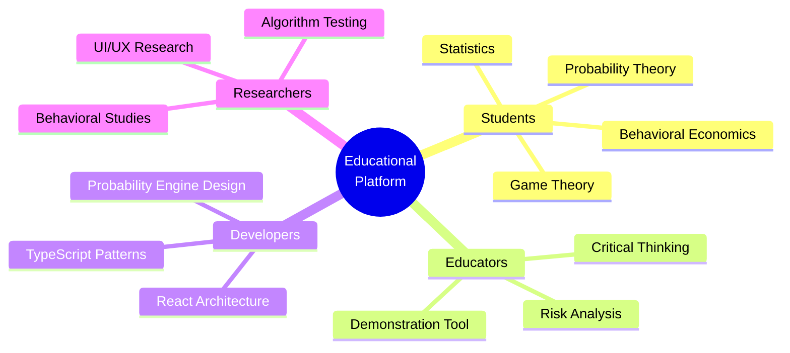

<details>
<summary><strong>🎓 Click to view detailed educational applications</strong></summary>

### For Students

**Probability Theory**  
Practical examples of discrete and continuous distributions.

**Statistics**  
Law of large numbers, expected value, variance analysis.

**Game Theory**  
Nash equilibrium in negative-sum games.

**Behavioral Economics**  
Cognitive biases in decision-making under uncertainty.

### For Educators

**Demonstration Tool**  
Visual probability experiments for classroom use.

**Risk Analysis**  
Understanding expected value, variance, and ruin probability.

**Critical Thinking**  
Evaluating claims of “winning strategies” mathematically.

### For Developers

**Probability Engine Design**  
Implementing RNG systems with provable fairness.

**React Architecture**  
State management in real-time applications.

**TypeScript Patterns**  
Strong typing for financial systems.

**Performance Optimization**  
Canvas rendering, memoization, throttling techniques.

### For Researchers

**Behavioral Studies**  
User decision patterns under uncertainty.

**Algorithm Testing**  
Validating house edge implementations.

**UI/UX Research**  
Psychological impact of near-misses and animations.

**Statistical Analysis**  
Convergence rates and variance in stochastic systems.

</details>

-----

## Transparency Statement

### Complete Honesty About Outcomes

This platform operates on a fundamental principle: **transparency over deception**.

|Aspect           |Our Approach                          |
|-----------------|--------------------------------------|
|**Source Code**  |100% open source and inspectable      |
|**Mathematics**  |Exact house edges, not approximations |
|**Outcomes**     |Independently verifiable through seeds|
|**Documentation**|All formulas and algorithms explained |

### What We Do NOT Do

❌ **Hide house edge** - Every game displays the exact percentage  
❌ **Manipulate outcomes** - RNG is deterministic and fair  
❌ **Use dark patterns** - No hidden auto-bets or deceptive UI  
❌ **Collect real money** - Virtual currency only  
❌ **Promote gambling** - Educational purpose only

### What Users Should Know

> **Long-term loss is guaranteed**  
> When house edge > 0, you will lose over time.

> **Variance is not opportunity**  
> Short-term wins are statistical noise.

> **No strategy can overcome math**  
> Betting systems cannot change expected value.

> **The house edge is not a challenge**  
> It’s a mathematical certainty, not a puzzle.

-----

## License

### GNU General Public License v3.0


This project is licensed under the **GNU General Public License v3.0**.

<details>
<summary><strong>📜 Click to view license details</strong></summary>

### Permissions

You are free to:

✅ **Use** the software for any purpose  
✅ **Study** how the software works  
✅ **Modify** the software to suit your needs  
✅ **Distribute** copies of the software  
✅ **Distribute** your modifications

### Conditions

**Copyleft**  
Derivative works must also be licensed under GPL-3.0.

**Source Availability**  
You must provide source code when distributing.

**License Notice**  
You must include the GPL-3.0 license text.

**State Changes**  
You must document modifications to the code.

### Implications for Derivatives

If you fork this project or build upon it:

- ✓ Your derivative work must remain open source
- ✓ Your derivative work must use GPL-3.0 license
- ✓ You must share your source code with users
- ✗ You cannot make your modifications proprietary

This ensures the educational mission remains intact: **knowledge stays free and accessible**.

### Commercial Use

While GPL-3.0 permits commercial use, this project includes an **educational disclaimer**:

|Permitted            |Required                   |
|---------------------|---------------------------|
|Use code commercially|Maintain GPL-3.0 compliance|
|Deploy for education |Keep educational warnings  |
|Modify for research  |Comply with gambling laws  |

⚠️ **Warning:** Deploying this for real-money gambling requires proper licensing and regulatory approval.

### Full License Text

See [`LICENSE.md`](./LICENSE.md) for complete legal terms.

### Disclaimer

The authors assume **no liability** for legal consequences of deploying this software for actual gambling operations.

</details>

-----

## Contributing

### Contribution Process

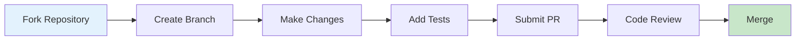

We welcome contributions that enhance the educational value of this platform.

### We Accept

|Type                     |Description                            |
|-------------------------|---------------------------------------|
|📚 **Educational Content**|Improved explanations and documentation|
|📊 **Visualizations**     |Better statistical charts and graphs   |
|🔬 **Demonstrations**     |New probability demonstrations         |
|🐛 **Bug Fixes**          |Code corrections and improvements      |
|♿ **Accessibility**      |WCAG compliance improvements           |

### We Do Not Accept

|Type                          |Reason                         |
|------------------------------|-------------------------------|
|❌ **Math Obscuration**        |Contradicts educational mission|
|❌ **Real Money Integration**  |Educational platform only      |
|❌ **Warning Removal**         |Ethically required             |
|❌ **Proprietary Dependencies**|GPL-3.0 compliance             |

<details>
<summary><strong>💻 Click to view code standards</strong></summary>

### Code Standards

**TypeScript**  
Strict mode enabled, no `any` types.

**Formatting**  
2-space indentation, semicolons required.

**Comments**  
Explain mathematical formulas and algorithms.

**Testing**  
Unit tests for probability calculations.

### Pull Request Template

```markdown
## Description
Brief description of changes

## Type of Change
- [ ] Bug fix
- [ ] New feature
- [ ] Documentation
- [ ] Educational content

## Testing
How was this tested?

## Educational Impact
How does this improve understanding?
```

</details>

-----

## Contact

### Getting Help

|Resource         |Link                                                                                       |
|-----------------|-------------------------------------------------------------------------------------------|
|**Documentation**|This README                                                                                |
|**Code Examples**|`pages/*.tsx`                                                                              |
|**Bug Reports**  |[GitHub Issues](https://github.com/yourusername/casino-education-platform/issues)          |
|**Discussions**  |[GitHub Discussions](https://github.com/yourusername/casino-education-platform/discussions)|

### Bug Report Template

<details>
<summary><strong>🐛 Click to view bug report format</strong></summary>

```markdown
**Environment**
Browser: Chrome 120.0.6099.130
OS: macOS 14.0
Screen: 1920x1080

**Description**
Clear description of the bug

**Steps to Reproduce**
1. Navigate to /crash
2. Place bet of 1000
3. Observe behavior

**Expected Behavior**
What should happen

**Actual Behavior**
What actually happened

**Console Errors**
Any error messages from browser console

**Screenshots**
If applicable
```

</details>

### Feature Request Template

<details>
<summary><strong>💡 Click to view feature request format</strong></summary>

```markdown
**Educational Goal**
What concept does this teach?

**User Benefit**
How does this improve understanding?

**Implementation Idea**
Suggested technical approach

**References**
Similar features in other educational tools

**Additional Context**
Any other relevant information
```

</details>

-----

## Final Words

<div align="center">

### The Fundamental Truth

</div>


> **In any probabilistic game with house edge > 0, sustained play guarantees mathematical loss.**

This is not theory. This is arithmetic certainty.

The law of large numbers ensures that over time, outcomes converge to expected value. When expected value is negative, convergence means loss.

### Why Transparency Matters

Traditional gambling platforms profit from:

1. **Mathematical advantage** (house edge)
1. **Information asymmetry** (hidden odds)
1. **Psychological manipulation** (near-misses, sounds, lights)

This platform removes **#2** and exposes **#3**.

The house edge remains (for educational demonstration), but users see **exactly** how it works.

### Use This Knowledge

Before ever risking real money:

✓ Understand that house edge cannot be overcome  
✓ Recognize that “winning strategies” are mathematical impossibilities  
✓ Realize that casinos don’t need to cheat—math does the work  
✓ Learn to identify cognitive biases that gambling exploits

<div align="center">

### The House Always Wins

**Not through deception.**

**Not through manipulation.**

**Through mathematics.**

-----

**Built for educational purposes under GPL-3.0**

**Learn. Understand. Make informed decisions.**

[](https://github.com/yourusername/casino-education-platform)

</div>